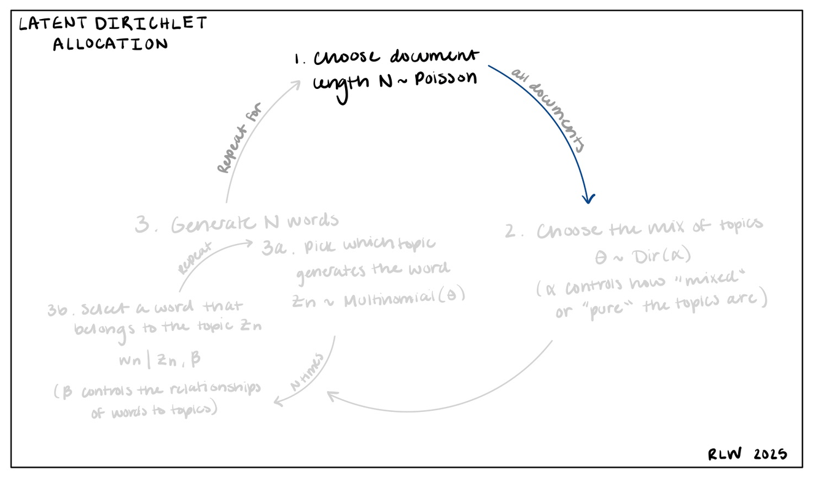

In this project, I explore two topic modeling techniques on a corpus of congressional bills. First, I implement a traditional Latent Dirichlet Allocation model, and second, a Correlated Topic Model. I compare and contrast both methods through their results. 

### A Refresher on Latent Dirichlet Allocation

Topic modeling is a natural language technique that assigns “topics” to documents in a corpus by assessing how words appear together across documents. **Latent Dirichlet Allocation (LDA)** is a common implementation of topic modeling that is *unsupervised*, *generative*, and *probabilistic*. In other words, it assesses the probability of patterns in a corpus and generates new examples of these patterns.

In LDA, Documents are represented as a random mixture of topics, and topics are characterized by a distribution over words. There are 3 steps for generating each document:

1. Choose the length of the document as the number of words $N \sim \text{Poisson}$

2. Choose the mix of topics $\theta \sim \text{Dir}(\alpha)$ where \(\alpha\) controls how “mixed” or “pure” the document topics are.

3. For all N words: 
Choose which topic generates the word $Z_n \sim \text{Multinomial}(\theta)$
Then choose the specific word from that topic $ (w | x, \beta)$ where \(\beta\) controls the relationships between words and topics

<figure style="text-align: center;">
  
  <figcaption>LDA Document Generation Process</figcaption>
</figure>

### Applying LDA to Congressional Legislation

I collected a corpus of 1,657 pieces of legislation from both the House of Representatives and Senate that are tagged with "Housing and Community Development". These contain any bill introduced in either chamber across all stages of the legislative process.  

I applied standard preprocessing including a custom set of stop words (such as ammend, subsection, paragraph) and lematization. I also created bigrams within documents such as "Fannie Mae" and "census tract".

With some consideration and parameter tuning, I settled on 24 topics across the corpus. The LDA model was implemented using the `Gensim` python library, with both the alpha and beta parameters set to `auto`. This feature of the gensim library allows the LDA model to learn an asymetric prior from the corpus itself. 

<iframe src="assets/lda_vis.html" width="100%" height="600px"></iframe>
